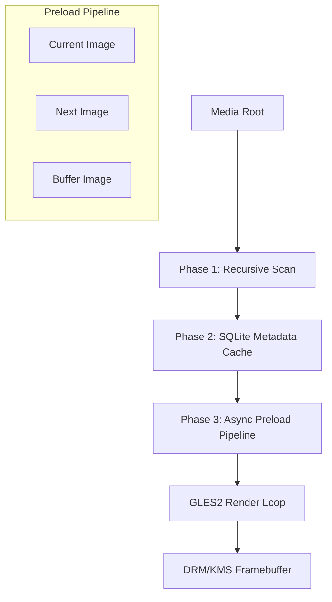

# piTrove

A professional-grade digital picture frame for the Raspberry Pi. Designed for extreme stability on network-attached storage (NAS), cinematic visual presentation, and seamless hardware acceleration on Pi 4 and Pi 5.

[](https://www.raspberrypi.com/)
[](https://www.debian.org/)
[](https://en.wikipedia.org/wiki/AArch64)
[](https://www.mesa3d.org/)
[](LICENSE)
[]()

## 🚀 Quick Start

### 1. OS Installation
1. Flash **Raspberry Pi OS Lite (64-bit)** using the [Raspberry Pi Imager](https://www.raspberrypi.com/software/).
2. Ensure you are using a 64-bit image; the application requires `aarch64`.
3. Boot the Pi, connect to your network, and SSH in: `ssh pi@<pi-ip>`.

### 2. One-Command Installation
Run the bootstrap script to handle dependencies, build the binary, and configure the systemd service:
```bash
wget -qO- https://raw.githubusercontent.com/UnDadFeated/piTrove/main/install.sh | sudo bash
```

---

## ✨ Key Features

### 🖼️ High-Performance Media Engine
- **Broad Format Support**: Native loading for JPEG, PNG, TIFF, WebP, HEIC/HEIF, BMP, and TGA.
- **Cinematic Visuals**: 
  - **Ken Burns Effect**: Smooth, configurable zoom and pan animations.
  - **Professional Transitions**: High-quality crossfades, wipes, and pixelate effects.
  - **Dynamic Ambient Lighting**: Photo-aware edge glow and bias lighting that blends the frame into the room.
  - **CRT Aesthetic**: Optional vignette and scanline overlays for a retro-digital look.
- **Video Integration**: Seamless interleaving of H.264/H.265 videos using `libmpv` with hardware acceleration (`drmprime-copy`).

### 📂 Enterprise-Grade Scanning & Cache
- **NAS Optimized**: Specialized `getdents64` implementation with timeout wrappers to prevent the "CIFS hang" common in standard filesystem libraries.
- **SQLite3 Persistence**: Uses a WAL-mode database to track file metadata, preventing redundant scans and tracking corrupted files to skip them permanently.
- **Temporal Filtering**: A "Seasonal Window" filter shows photos from the current time of year across any year (e.g., show only "December" photos every December).
- **Intelligent Cooldown**: Ensures the same photo isn't shown too frequently (default 330-day cooldown).

### 🛠️ System & Control
- **Headless Design**: Operates via DRM/KMS (native framebuffer). No X11 or Wayland required.
- **Low Power**: Scheduled display sleep/wake times and automatic backlight dimming.
- **Remote Control**: Built-in HTTP API for remote navigation (`/api/next`, `/api/prev`, `/api/pause`).
- **TUI Configurator**: A robust, adaptive terminal-based wizard for configuring all aspects of the engine over SSH.

---

## ⚙️ Technical Architecture



- **Language**: C++17 / OpenGL ES 3.0
- **Core Libraries**: SDL2 (kmsdrm), libmpv, SQLite3, libexif, libheif.
- **Hardware Accel**: Pi 5 VC4 DRM/KMS with GLES3 shaders.

## 📁 Project Structure
```
src/
├── main.cpp          — Entry point, event loop, DRM master flow
├── scanner.cpp/h     — Recursive media scanning (getdents64)
├── cache.cpp/h       — SQLite3 WAL-mode metadata persistence
├── config.cpp/h      — TOML config parser
├── preload.cpp/h     — Two-phase async preload (surface → texture upload)
├── renderer.cpp/h    — SDL_Renderer primitives, EXIF rotation, TTF text
├── overlay.cpp/h     — CRT vignette, scanlines, bias lighting
├── transition.cpp/h  — GLES3 shader transitions (crossfade, wipe, pixelate)
├── mpv_player.cpp/h  — mpv subprocess (drmDropMaster/drmSetMaster)
├── image_loader.cpp/h — IMG_Load wrapper (JPEG, PNG, TIFF, WebP, HEIC)
├── font_render.cpp/h  — TTF_RenderUTF8_Blended glow text
├── util.cpp/h         — trim, safe_stoi, safe_stof, safe_stoll helpers
├── shaders/           — GLES3 GLSL vertex/fragment shaders
├── fonts/             — DejaVuSansMono-Bold.ttf
├── config.toml        — Default config template
├── splash.png         — Splash screen image
```
- `install.sh`: Bootstrap installer (runs as standard user, sudo for privileged ops).
- `CHANGELOG.md`: Detailed version history.

---
MIT License
