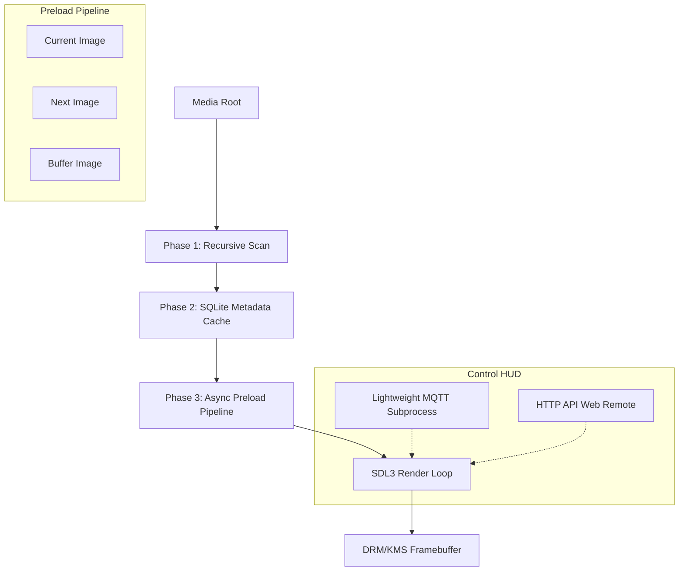

# piTrove — C++ Digital Picture & Video Frame for Raspberry Pi

🌐 **[View Live Premium Documentation & Landing Page](https://undadfeated.github.io/piTrove/)**

A professional-grade, **containerized** digital picture & video frame application for the Raspberry Pi 4 & 5. Orchestrated via **Docker & Compose** for absolute dependency isolation and read-only media storage safety. Designed for extreme stability on network-attached storage (NAS), cinematic visual presentation, native H.264/H.265 video integration, smart home integrations (MQTT + Home Assistant Auto-Discovery), premium glassmorphic web controls, and seamless hardware acceleration.

[](https://www.raspberrypi.com/)
[](https://www.docker.com/)
[](https://www.debian.org/)
[](https://en.wikipedia.org/wiki/AArch64)
[](https://www.libsdl.org/)
[]()

## 🚀 Quick Start

### 1. OS Installation
1. Flash **Raspberry Pi OS Lite (64-bit)** using the [Raspberry Pi Imager](https://www.raspberrypi.com/software/).
2. Ensure you are using a 64-bit image; the application requires `aarch64`.
3. Boot the Pi, connect to your network, and SSH in: `ssh pi@<pi-ip>`.

### 2. One-Command Containerized Installation
Run the bootstrap script to automatically install Docker Engine, mount your storage, build the multi-stage slideshow container, and register the systemd daemon:
```bash
wget -qO- https://raw.githubusercontent.com/UnDadFeated/piTrove/main/install.sh | sudo bash
```

### 3. Management & Interaction
Once the installation completes, the picture frame runs automatically in the background on startup. You can manage the application using standard Docker Compose or systemd controls:

- **Configure the Frame (Interactive TUI Settings Wizard)**:
  ```bash
  pitrove config
  ```
- **Restart Slideshow Daemon**:
  ```bash
  pitrove restart
  ```
- **View Slide Rendering Logs in Real-Time**:
  ```bash
  pitrove logs
  ```
- **Check Container Health Status**:
  ```bash
  pitrove status
  ```
- **Reorganize Media Archive**:
  ```bash
  sudo ./install.sh --organize /path/to/archive
  ```
  *(Launches the interactive organizer to group files chronologically, add date-prefixes in-place, or disable seasonal scanning in config.toml)*
- **Update Application & Run Migration**:
  ```bash
  sudo ./install.sh --update [--cron]
  ```
  *(Fetches the latest code/binary, rebuilds the container, and safely merges new configurations. Adding the `--cron` flag schedules this check to run daily in the background.)*
  
  *(For raw manual execution, the CLI transparently runs: `docker exec -it piTrove /app/piTrove --config /app/config/config.toml`)*

---

## ✨ Key Features

### 🖼️ High-Performance Media Engine
- **Broad Format Support**: Native loading for JPEG, PNG, TIFF, WebP, HEIC/HEIF, BMP, and TGA.
- **Cinematic Visuals**: 
  - **Twin-Portrait Collage**: Automatically groups adjacent portrait-format images to display them side-by-side in a split-screen collage with individual frame borders and animations.
  - **Ken Burns Effect**: Smooth, configurable zoom and pan animations.
  - **Professional Transitions**: High-quality crossfades, wipes, pixelate, and dissolve effects.
  - **Dynamic Ambient Lighting**: Photo-aware edge glow and bias lighting that blends the frame into the room.
  - **CRT Aesthetic**: Optional vignette and scanline overlays for a retro-digital look.
- **Video Integration**: Seamless interleaving of H.264/H.265 videos using an accelerated `mpv` subprocess rendering directly via native DRM/KMS.
- **Dynamic CPU Core Scaling**: Dynamically detects available hardware cores and allocates `max_cores - 1` decoding threads to play videos, maximizing hardware efficiency while keeping a core free for background system integrity.

### 📂 Enterprise-Grade Scanning & Cache
- **NAS Optimized**: Specialized `getdents64` implementation with timeout wrappers to prevent the "CIFS hang" common in standard filesystem libraries.
- **SQLite3 Persistence**: Uses a WAL-mode database to track file metadata, preventing redundant scans and tracking corrupted files to skip them permanently.
- **Smart Content Filtering**: Built-in zero-overhead deterministic classifier to filter out non-photographic clutter and prioritize family/wildlife photos.
  - **Keep People**: Automatically detects and keeps photos of family, friends, trips, and portraits based on comprehensive path keyword analysis and hash distribution.
  - **Keep Animals**: Intelligently retains photos containing family pets, wildlife, and animal encounters.
  - **Auto-Filter Clutter**: Automatically identifies and filters out screenshots, scanned documents, receipts, spreadsheets, text graphics, and system icons by default.
  - **TUI Integration**: Toggle filters on the fly via the TUI config wizard (`Keep People` and `Keep Animals` options) or within `config.toml`.
- **Temporal Filtering**: A "Seasonal Window" filter shows photos from the current time of year across any year (e.g., show only "December" photos every December).
- **Intelligent Cooldown**: Ensures the same photo isn't shown too frequently (default 330-day cooldown).
- **Robust Skip Pipeline**: Gracefully intercepts deleted, missing, or corrupt assets, dynamically marking them bad in the cache database and removing them from the queue to prevent application interruptions.

### 🛰️ MQTT & Home Assistant Smart Home Integration
- **Lightweight Subscriber Pipe**: Spawns a background subprocess listener executing `mosquitto_sub -F "%t:%p"` to receive remote controls instantly and safely with zero rendering loop delay.
- **Home Assistant Auto-Discovery**: Automatically publishes standard JSON config payloads to `homeassistant/` on startup. Instantly registers:
  - **Screen Switch** (Toggles physical backlight and solid black blanking overlay)
  - **Skip Next & Previous Buttons** (Remote slideshow navigation)
  - **Play/Pause Toggle Button** (Remote execution control)
  - **Motion Binary Sensor** (Auto-syncs with physical room motion)
- **Automatic Cooldown Blanking**: Monitors the room's motion sensor topic. If no motion is detected within a customizable cooldown window, it blanks the screen physically using `vcgencmd display_power 0` and clears the framebuffer to black. Wakes up instantly on new motion or key down/mouse events.

### ☁️ Cloud Integration
- **Google Photos Synchronization**: Syncs photos directly from user-selected Google Photos albums, storing them in a local cache directory with customizable check intervals. Includes robust OAuth2 authentication validation and user-friendly step-by-step setup prompts built directly into the installer.

### 🛠️ System & Control
- **Headless Design**: Operates via DRM/KMS (native framebuffer). No X11 or Wayland required.
- **Dynamic Display & GPU Probing**: Programmatically queries active connected DRM/KMS connector outputs and indices (sysfs `card*-*/status`), auto-configuring stable KMSDRM environments before SDL3 starts up.
- **Low Power**: Scheduled display sleep/wake times and automatic backlight dimming.
- **Glassmorphic HTTP HUD & Settings Control Panel**: Built-in glassmorphic web dashboard featuring interactive player controls, dynamic slideshow diagnostics telemetry (temp, cache DB size, queue size), complete configuration settings editing (with toggles for touchscreen mode, playlist shuffle, Ken Burns transitions, background blur, color-matched matte options, and video volume), live system logs stream (with scroll-preservation control), active MQTT broker connection cards, screen switches, and simulated motion triggers.
- **TUI Hardware & Config Wizard**: A robust, 10-tab terminal-based configurator menu over SSH featuring dedicated `"Hardware Settings"` and `"MQTT Integration"` menus to dynamically configure all frame variables.
- **Interactive Touchscreen Control**: When touchscreen mode is enabled, touching the screen displays floating navigation overlays (Previous, Settings, Next) to easily advance or go back. The configuration menu features +/- buttons, volume sliders, and a full numerical keyboard modal for on-screen adjustments.
- **Config Clamping Safety**: Implements 10 strict boundary checks and clamp safety validation logic inside the TOML configuration loader to guarantee system resilience.

### 🛡️ Concurrency, Reliability & Security Safeguards
- **Active Software Watchdog**: Background watchdog monitoring thread that automatically triggers an immediate container restart if the main slideshow loop stalls or freezes for more than 45 seconds.
- **Non-Blocking Network Mount Verification**: Proactive TCP socket reachability checks before executing any directory scans or file operations on remote network filesystems (SMB/NFS), completely eliminating application lockups on disconnected mounts.
- **Async-Signal-Safe Crash Recovery**: Replaced heap allocations in signal handlers with a pre-allocated static cache buffer, preventing deadlocks or secondary crashes during abnormal process termination.
- **Dynamic Touchscreen Hotplugging**: Periodic background device checks to automatically re-detect and bind touchscreen controllers reconnected at runtime without requiring an application restart.
- **Google Photos SSRF Protection**: Rigorous scheme and domain parsing verification for dynamic download links to shield the system from unauthorized web redirects during cloud synchronization.
- **Command Option Injection Shield**: Built-in shell argument escape sanitization and `--` command qualifiers prepended to all curl file download commands.
- **Web Server Capacity & Slowloris Shield**: Concurrent web dashboard client capacity increased to 32 slots, with a minimum socket read/write timeout of 2 seconds to prevent resource exhaustion from hanging/stale clients.
- **Non-Discarding Preload Cache**: Vector lookup preloading queue that allows out-of-order cached image retrieval, ensuring successfully preloaded slides are not discarded when skipped or sought out of order.
- **Proactive Network & Interface Probing (`E102` / `E103`)**: Dynamic socket and interface status query checks via POSIX interface mappings, detecting local connection drops (`E102`) or DHCP configuration/IP conflicts (`E103`) immediately and aborting network-dependent mounts.
- **Critical Storage Capacity Verification (`E403`)**: Continuous available space checking on the cache drive to pause background sync tasks and warn when storage is critically low (< 50MB).
- **DNS Resolution Monitoring (`E105`)**: Domain resolution checks on sync failures to distinguish name server/DNS lookup faults from bad credentials.
- **Cache Filesystem Read-Only Auditing (`E405`)**: Directory writability checks on startup to detect permission restrictions.
- **SQLite Concurrency & Timeout Tracking (`E402` / `E408`)**: Database transaction checking to report write timeouts or structural storage failures.

## ⚙️  Technical Architecture



- **Language**: C++17
- **Core Libraries**: SDL3, SDL3_image, SDL3_ttf, libmpv, SQLite3, libexif, libheif, `mosquitto-clients`.
- **Hardware Accel**: Pi 4/5 VC4 DRM/KMS via SDL3 rendering.

## 📂 Project Structure
```
src/
├── main.cpp          — Entry point, event loop, DRM master flow, motion cooldown
├── mqtt.cpp/h        — Background MQTT subprocess subscriber & HA discovery [NEW]
├── google_photos.cpp/h — Google Photos cloud synchronization and album manager [NEW]
├── error_db.cpp/h    — Diagnostic error catalog definitions & metadata [NEW]
├── blur.cpp/h        — Separable box blur filter & matte color computation [NEW]
├── scanner.cpp/h     — Recursive media scanning (getdents64)
├── cache.cpp/h       — SQLite3 WAL-mode metadata persistence
├── config.cpp/h      — TOML config parser & boundary validation
├── tui.cpp/h         — Terminal-based setup & configuration wizard (10 categories)
├── preload.cpp/h     — Two-phase async preload (surface → texture upload)
├── renderer.cpp/h    — SDL_Renderer primitives, EXIF rotation, bias lighting, CRT vignette
├── overlay.cpp/h     — OSD widgets (date, filename, count, timer, clock)
├── transition.cpp/h  — High-performance SDL3 transitions (crossfade, wipe, pixelate, dissolve)
├── mpv_player.cpp/h  — mpv subprocess controller (drmDropMaster/drmSetMaster)
├── image_loader.cpp/h — IMG_Load wrapper (JPEG, PNG, TIFF, WebP, HEIC)
├── font_render.cpp/h  — TTF_RenderUTF8_Blended glow text
├── media_item.h      — Photo and video data structures
├── util.cpp/h         — String parsing, safety, and path utilities
├── fonts/             — Monospace layout fonts (DejaVuSansMono-Bold.ttf)
├── config.toml        — Default config template
└── splash.png         — Boot splash screen image
```
- `install.sh`: Bootstrap installer (sets up Docker Compose plugins, NAS mounts, and systemd units).
- `CHANGELOG.md`: Detailed version history.

---
MIT License

