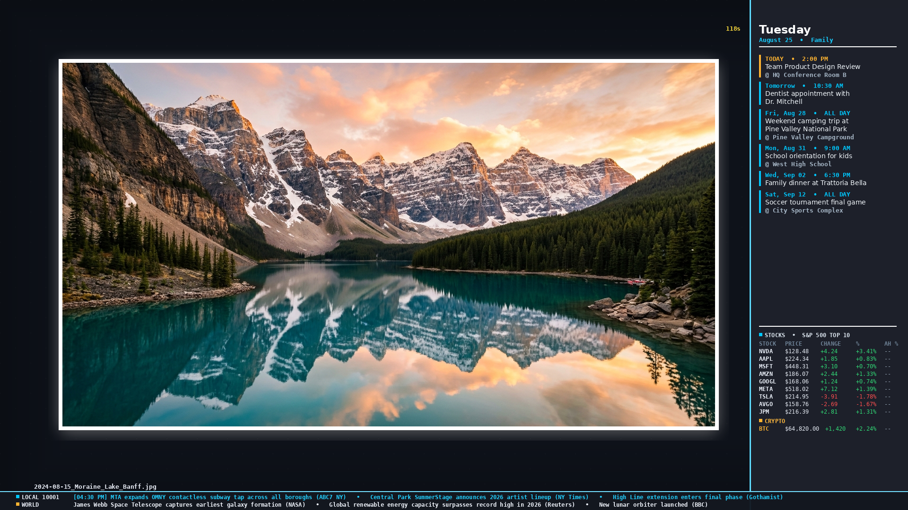

# piTrove — C++ Digital Picture & Video Frame for Raspberry Pi

<p align="center">
<a href="https://www.raspberrypi.com/"></a>
<a href="https://www.debian.org/"></a>
<a href="https://en.wikipedia.org/wiki/AArch64"></a>
<a href="https://www.libsdl.org/"></a>

</p>

<p align="center">
  
</p>

Professional-grade, **containerized** digital picture & video frame application for Raspberry Pi 4 & 5. Built with C++23, SDL3 DRM/KMS direct GPU rendering, hardware-accelerated FFmpeg video decoding, live sidebar Google Calendar & StockStreamer infopanels, dual-source local/world news ticker, NAS storage auto-mounting, and zero-touch auto-updates.

🌐 **[Live Documentation & Landing Page](https://undadfeated.github.io/piTrove/)**

---

## 🚀 Quick Start

### 1. OS Installation

1. Flash **Raspberry Pi OS Lite (64-bit)** using the [Raspberry Pi Imager](https://www.raspberrypi.com/software/).
2. Boot, connect to your network, and SSH in: `ssh pi@<pi-ip>`

### 2. One-Command Installation

```bash
wget -qO- https://raw.githubusercontent.com/UnDadFeated/piTrove/main/install.sh | sudo bash
```

The installer handles everything: Docker Engine, NAS mount configuration, DRM/KMS setup, container build, systemd service, and auto-update cron job.

### 3. Management

```bash
pitrove config    # Interactive TUI settings wizard
pitrove restart   # Restart the slideshow
pitrove logs      # Real-time render logs
pitrove status    # Container health
```

```bash
# Update application
sudo ./install.sh --update

# Reorganize media archive
sudo ./install.sh --organize /path/to/archive
```

---

## ✨ Key Features

### 🖼 Media Engine

- **Broad Format Support**: JPEG, PNG, TIFF, WebP, HEIC/HEIF, BMP, TGA
- **In-Process Video Playback**: H.264/H.265/AV1 in-process FFmpeg decode with hardware acceleration
- **PTS-Based A/V Synchronization**: Wall-clock anchored presentation clock (`av_sync`) ensuring synchronized audio and video without drift
- **Pi 4/5 Auto-Detection**: DRM hwaccel (Pi 5) or V4L2 M2M (Pi 4) with multi-threaded software fallback for high-bitrate 4K clips
- **Twin-Portrait Collage**: Side-by-side portrait layout for adjacent vertical photos
- **Ken Burns Effect**: Smooth zoom and pan animations
- **Professional Transitions**: Crossfade, wipe, pixelate, dissolve
- **Dynamic Bias Lighting**: Photo-aware edge glow with 5 animation styles
- **Adaptive Overlays**: Filename, date, countdown timer, clock, diagnostics HUD
- **CRT Aesthetic**: Optional vignette and scanline overlays
- **Physical Matte Frame Calibration**: Optical centering and global canvas offset for 1" physical matte frames

### 📊 Infopanels Subsystem

- **Google Calendar Agenda Sync**: Native iCal feed sync (supports secret and public URLs) with text auto-wrapping bounded by the physical frame opening, multi-line cards, and dynamic accent indicator pills.
- **Stock Streamer**: Real-time S&P 500 stocks + Bitcoin ticker with quick presets (`sp500_top10`, `big_tech`, `semiconductors`, `dividend_kings`, `custom`) and after-hours tracking.
- **Live News Ticker**: Dual-source scrolling ticker with local community headlines (auto-geocoded ZIP/City search via Google News RSS) + Google Top Stories.

### 💻 Universal TUI Configuration Wizard

- **Universal Terminal Compatibility**: Standardized VT100/ANSI rendering preserving native background transparency in **Alacritty** (CachyOS/Arch/Fedora), **Windows Terminal**, **PowerShell**, **Command Prompt**, **macOS Terminal**, **Kitty**, and **WezTerm**.
- **Smart Assist Tools**:
  - **Weather Geocoding**: Enter a ZIP code or city name to auto-resolve latitude & longitude coordinates.
  - **Stock Presets**: 1-click ticker bundles.
  - **Google Calendar URL Builder**: Direct secret & public iCal setup.
- **Dynamic Category Viewport**: Automatically scales footer navigation to fit large menus (20+ items).

### 📂 Smart Scanning & Cache

- **NAS-Optimized**: CIFS hang prevention with timeout wrappers and I/O throttle protection
- **SQLite3 WAL Persistence**: Zero redundant scans across restarts
- **Seasonal Window**: Month-based temporal filtering
- **On-This-Day**: Anniversary photo matching with configurable tolerance
- **Intelligent Cooldown**: 330-day default rotation cycle
- **Content Filtering**: Auto-filter screenshots, documents, receipts
- **Preload Pipeline**: Multi-threaded async image preloading

### 🛰 Integrations

- **MQTT & Home Assistant**: Auto-discovery, remote controls, and display wake-up support for popular motion sensors (HC-SR501, AM312, RCWL-0516, ESPHome/Tasmota ESP32 nodes, and Zigbee/Z-Wave sensors via Home Assistant / Zigbee2MQTT)
- **Google Photos**: Cloud sync with OAuth2 refresh tokens
- **HTTP Dashboard**: Glassmorphic web control panel with live telemetry
- **Touchscreen Control**: Native evdev input with floating navigation
- **Sleep/Wake Scheduling**: Automatic display power management

### 🛡 Reliability

- **Docker Containerized**: Full dependency isolation, build-once deployment
- **Software Watchdog**: In-app heartbeat with Docker + systemd restart chain
- **Network Recovery**: Gateway monitoring with automatic Wi-Fi reset
- **Video Stall Detection**: 30s timeout with forced decoder recovery
- **Async-Signal-Safe**: Pre-allocated crash handlers, no heap in signal paths
- **OLED Burn-In Prevention**: Pixel shifting and content rotation
- **Auto-Update System**: Daily cron-based updates with config merge
- **PIN-Protected Dashboard**: 4-digit access lock

---

## ⚙️ Technical Architecture

```
Media Root → Recursive Scan → SQLite Cache → Async Preload → SDL3 Render Loop → DRM/KMS
```

- **Language**: C++23
- **Core**: SDL3, SDL3_image, SDL3_ttf, FFmpeg 7.1.5 (libavcodec/libavformat/libswscale/libswresample), SQLite3, libexif, libheif
- **HW Accel**: Pi 5 DRM (vc4-kms-v3d) / Pi 4 V4L2 M2M / SW fallback
- **Target**: Debian Trixie Lite 64-bit on Raspberry Pi 4 & 5

---

## 📂 Project Structure

```
src/
├── main.cpp              — Entry point, render loop, event handling
├── calendar.cpp/h        — Google Calendar iCal sync, text wrapping, card layout
├── stock_streamer.cpp/h  — S&P 500 stocks & Bitcoin real-time quote streamer
├── news_ticker.cpp/h     — Dual-feed local/world RSS news crawler & ticker
├── video_decoder.cpp/h   — FFmpeg decode + hwaccel + audio PTS synchronization
├── transition.cpp/h      — GPU transitions (crossfade, wipe, pixelate, dissolve, ken burns)
├── overlay.cpp/h         — OSD widgets (timer, date, filename, clock, diagnostics)
├── font_render.cpp/h     — Cached + uncached text rendering
├── renderer.cpp/h        — SDL3 primitives, bias lighting, CRT vignette
├── image_loader.cpp/h    — Multi-format image loading
├── scanner.cpp/h         — Recursive media scanning (getdents64)
├── cache.cpp/h           — SQLite3 WAL-mode metadata persistence
├── preload.cpp/h         — Async image preloading queue
├── config.cpp/h          — TOML config parser & validation
├── tui.cpp/h             — Universal terminal configuration wizard
├── mqtt.cpp/h            — MQTT subscriber & Home Assistant discovery
├── google_photos.cpp/h   — Google Photos cloud sync
├── http_server.cpp/h     — Web dashboard & remote control API
├── organizer.cpp/h       — Media archive organizer
├── blur.cpp/h            — Box blur filter & matte color computation
├── error_db.cpp/h        — Diagnostic error catalog
├── health.cpp/h          — System health monitoring
├── thermal.cpp/h         — SoC thermal monitoring
├── safe_mode.cpp/h       — Crash recovery & safe mode
├── auth.cpp/h            — Dashboard authentication
├── preprocess.cpp/h      — Background EXIF preprocessing
├── util.cpp/h            — Utilities, string parsing, safety, geocoding
├── media_item.h          — Media data structures
├── interfaces.h          — Interface definitions
├── expected.h            — Expected type implementation
├── fonts/                — DejaVuSansMono-Bold.ttf
├── config.toml           — Default configuration
└── splash.png            — Boot splash screen
```

- `install.sh`: Bootstrap installer (Docker, NAS, systemd, auto-update)
- `CHANGELOG.md`: Detailed version history

## License

GNU GPLv3 (or later) License
