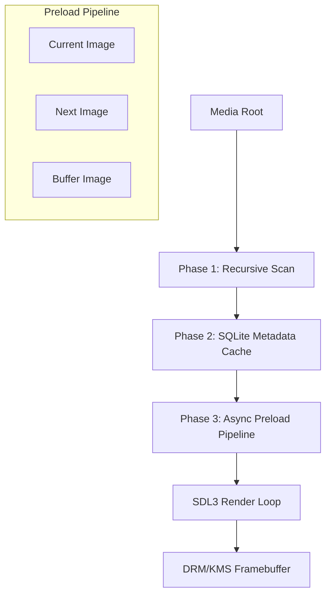

# piTrove

A professional-grade digital picture frame for the Raspberry Pi. Designed for extreme stability on network-attached storage (NAS), cinematic visual presentation, and seamless hardware acceleration on Pi 4 and Pi 5.

[](https://www.raspberrypi.com/)
[](https://www.debian.org/)
[](https://en.wikipedia.org/wiki/AArch64)
[](https://www.libsdl.org/)
[]()

## 🚀 Quick Start

### 1. OS Installation
1. Flash **Raspberry Pi OS Lite (64-bit)** using the [Raspberry Pi Imager](https://www.raspberrypi.com/software/).
2. Ensure you are using a 64-bit image; the application requires `aarch64`.
3. Boot the Pi, connect to your network, and SSH in: `ssh pi@<pi-ip>`.

### 2. One-Command Installation
Run the bootstrap script to handle dependencies, build the binary, and configure the systemd service:
```bash
wget -qO- https://raw.githubusercontent.com/UnDadFeated/piTrove/main/install.sh | sudo bash
```

---

## ✨ Key Features

### 🖼️ High-Performance Media Engine
- **Broad Format Support**: Native loading for JPEG, PNG, TIFF, WebP, HEIC/HEIF, BMP, and TGA.
- **Cinematic Visuals**: 
  - **Twin-Portrait Collage**: Automatically groups adjacent portrait-format images to display them side-by-side in a split-screen collage with individual frame borders and animations.
  - **Ken Burns Effect**: Smooth, configurable zoom and pan animations.
  - **Professional Transitions**: High-quality crossfades, wipes, pixelate, and dissolve effects.
  - **Dynamic Ambient Lighting**: Photo-aware edge glow and bias lighting that blends the frame into the room.
  - **CRT Aesthetic**: Optional vignette and scanline overlays for a retro-digital look.
- **Video Integration**: Seamless interleaving of H.264/H.265 videos using an accelerated `mpv` subprocess rendering directly via native DRM/KMS.
- **Dynamic CPU Core Scaling**: Dynamically detects available hardware cores and allocates `max_cores - 1` decoding threads to play videos, maximizing hardware efficiency while keeping a core free for background system integrity.

### 📂 Enterprise-Grade Scanning & Cache
- **NAS Optimized**: Specialized `getdents64` implementation with timeout wrappers to prevent the "CIFS hang" common in standard filesystem libraries.
- **SQLite3 Persistence**: Uses a WAL-mode database to track file metadata, preventing redundant scans and tracking corrupted files to skip them permanently.
- **Smart Content Filtering**: Built-in zero-overhead deterministic classifier to filter out non-photographic clutter and prioritize family/wildlife photos.
  - **Keep People**: Automatically detects and keeps photos of family, friends, trips, and portraits based on comprehensive path keyword analysis and hash distribution.
  - **Keep Animals**: Intelligently retains photos containing family pets, wildlife, and animal encounters.
  - **Auto-Filter Clutter**: Automatically identifies and filters out screenshots, scanned documents, receipts, spreadsheets, text graphics, and system icons by default.
  - **TUI Integration**: Toggle filters on the fly via the TUI config wizard (`Keep People` and `Keep Animals` options) or within `config.toml`.
- **Temporal Filtering**: A "Seasonal Window" filter shows photos from the current time of year across any year (e.g., show only "December" photos every December).
- **Intelligent Cooldown**: Ensures the same photo isn't shown too frequently (default 330-day cooldown).
- **Robust Skip Pipeline**: Gracefully intercepts deleted, missing, or corrupt assets, dynamically marking them bad in the cache database and removing them from the queue to prevent application interruptions.

### 🛠️ System & Control
- **Headless Design**: Operates via DRM/KMS (native framebuffer). No X11 or Wayland required.
- **Dynamic Display & GPU Probing**: Programmatically queries active connected DRM/KMS connector outputs and indices (sysfs `card*-*/status`), auto-configuring stable KMSDRM environments before SDL3 starts up.
- **Low Power**: Scheduled display sleep/wake times and automatic backlight dimming.
- **Remote Control & Dynamic Port Fallback**: Built-in HTTP API for remote navigation, with robust TCP socket collision scavenging that automatically checks consecutive ports (starting from `8080` up to 10 retries) if the port is already bound.
- **TUI Hardware & Config Wizard**: A robust, terminal-based configurator menu over SSH featuring a dedicated `"Hardware Settings"` menu to dynamically configure DRM connectors, GPU card paths, custom system font overlays, and custom audio device output mapping.

---

## ⚙️ Technical Architecture



- **Language**: C++17
- **Core Libraries**: SDL3, SDL3_image, SDL3_ttf, libmpv, SQLite3, libexif, libheif.
- **Hardware Accel**: Pi 4/5 VC4 DRM/KMS via SDL3 rendering.

## 📁 Project Structure
```
src/
├── main.cpp          — Entry point, event loop, DRM master flow
├── scanner.cpp/h     — Recursive media scanning (getdents64)
├── cache.cpp/h       — SQLite3 WAL-mode metadata persistence
├── config.cpp/h      — TOML config parser
├── tui.cpp/h         — Terminal-based setup & configuration wizard
├── preload.cpp/h     — Two-phase async preload (surface → texture upload)
├── renderer.cpp/h    — SDL_Renderer primitives, EXIF rotation, bias lighting, CRT vignette
├── overlay.cpp/h     — OSD widgets (date, filename, count, timer, clock)
├── transition.cpp/h  — High-performance SDL3 transitions (crossfade, wipe, pixelate, dissolve)
├── mpv_player.cpp/h  — mpv subprocess controller (drmDropMaster/drmSetMaster)
├── image_loader.cpp/h — IMG_Load wrapper (JPEG, PNG, TIFF, WebP, HEIC)
├── font_render.cpp/h  — TTF_RenderUTF8_Blended glow text
├── media_item.h      — Photo and video data structures
├── util.cpp/h         — String parsing, safety, and path utilities
├── fonts/             — Monospace layout fonts (DejaVuSansMono-Bold.ttf)
├── config.toml        — Default config template
└── splash.png         — Boot splash screen image
```
- `install.sh`: Bootstrap installer (runs as standard user, sudo for privileged ops).
- `CHANGELOG.md`: Detailed version history.

---
MIT License
